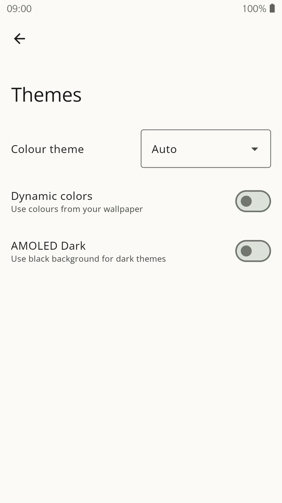

[](https://jitpack.io/#sadellie/themmo)

# Tutorial and usage showcase
## [*Click here to read the article on Medium!*](https://medium.com/@sadellie.dev/how-to-simplify-theming-in-your-app-c2edf3203fc2)


# Disclaimer
This project is just a proof-of-concept. Currently the library is used by me only. If you have somehow ended up finding this repository and want to use Themmo, feel free to do so.



# About
Themmo is a special composable component that replaces commonly used MaterialTheme composable. Main goal of this project is to make a universal way of dealing with theming in Compose.

Themmo is not a theming engine.

## Features
- Material Design 3 support
- Covers complex use cases
    - Automatic Light/Dark theme
    - Dynamic Theming (Monet) for devices with Android 8.1+ (yes, old devices can use it too)
    - AMOLED Theming
- Easy migration for existing projects
- UX-first approach. Basically, if implemented correctly, your users will not struggle with theming in your app
- Animated color scheme changes
- DataStore support
- Minimum API level: 21

# How to install
1. Add the JitPack repository to your build file
```kotlin
repositories {
	...
	maven( url = "https://jitpack.io" )
}
```

2. Add the dependency. Replace `Tag` with the latest version from [releases](https://github.com/sadellie/themmo/releases/latest) section(i.e. `0.0.2`).
```kotlin
dependencies {
	...
	implementation("com.github.sadellie:themmo:Tag")
}
```
# Basic usage
Themmo composable passes down a ThemmoController that is used to manipulate theming for all composables inside of Themmo.

For example, if you want to force your app to use dark colorScheme:
```kotlin
themmoController.setThemingMode(ThemingMode.FORCE_DARK)
```

## Themmo
This is the main composable that wraps your app and colors all your components.
I recommend you wrapping your whole app with it.

## ThemmoController
ThemmoController provides current state of theming options and methods that change those options.

## Theming options
### Day/Night preference
`AUTO` will follow system preference on which theme to use. Uses `isSystemInDarkTheme()` method.

`FORCE_LIGHT` will use light colors.

`FORCE_DARK` will use dark colors.

### Dynamic theming preference
When set to `true` will:

- Below API 27
  Falls back and uses provided colorScheme.
  Note: `enableDynamicTheming()` method can be called only on devices with API 27+, so this case is here just to keep theming idiot-proof.
- API from 27 to 30
  Uses custom implementation of dynamic theming (fake Monet). Uses primary color of user wallpaper and shifts it to generate light/dark colorScheme. Text colors are using black/white appropriately.
- Above API 30
  Uses `dynamicColorTheme()` from Material 3 library (real Monet).

### AMOLED theming preference
When set to `true` will change background color to black. Works only when dark color scheme is used, you don't need to worry about it.

### Custom color
When set to `Color.Unspecified` will not be used.
When set to anything other than `Color.Unspecified` (`Color.Red`, for example) will use custom method to generate color scheme for provided color.

***NOTE:*** Custom color is used only when Dynamic color is set to `false`.

# Sample apps
This repository has one sample application. It covers the most basic usage: how to switch theming options.
For a more advanced usage checkout [Apps built with Themmo section](#apps-built-with-themmo).

# Integration and migration
If you have your app wrapped in MaterialTheme composable, change it to Themmo composable.

OR

If you have your own Theme composable with MaterialTheme in it, you could also change MaterialTheme to Themmo composable. Just don't forget to pass down ThemmoController.

# Documentation
Practically everything is documented. You can use documentation snippets provided by Android Studio.

P.S. Themmo is easy to use, you probably will just need a simple use case as an example.

# DataStore support
You probably want to restore theming preferences after application restart.

When developing Themmo, a DataStore integration was taken into account.

- Dynamic and AMOLED theming preference states are represented as booleans. You can simply save and restore them with `booleanPreferencesKey`.

- Day/Night preference is using Enum classes so you can't just save and restore them.
	- When saving Day/Night preference state, use `.name` property. It will get you a string that can be used with `stringPreferencesKey`.
	- When restoring Day/Night preference, use `ThemingMode.valueOf(...)` method. This method will parse provided string and convert it to Enum. Case sensitive, though.

P.S. Non-DataStore users will have to adapt this solution or come with their own.

# Tests
Most of the methods are covered with tests. They are very primitive so far, but I will probably add a few more edge cases.
Trying TDD approach.

The only part that is not covered with tests is dynamic theming.

# Contributing
Pull requests and other activities on this repository are welcomed.

# Future updates
Themmo, in it's current state, is already production ready (except for fake Monet, which can rarely generate bad color scheme). While I do not guarantee of this project to be frequently updated, I will at least try to keep used dependencies up-to-date.

There are still some features, that I will probably add.
1. Upload artifact somewhere
2. Ability to generate color scheme from user provided color(s). It's easy to implement, but I need to find a good UX flow for this feature.
3. Something else?

# Monet library
Themmo uses [Monet by Kyant0](https://github.com/Kyant0/Monet).

# Apps built with Themmo
As of now Themmo is used only in my app called [Unitto](https://github.com/sadellie/unitto). Themmo was originally a part of it, but has expanded into it's own project. I recommend using this project as a sample for DataStore integration.

# Other theming libraries
Checkout [ThemeEngine](https://github.com/prathameshmm02/ThemeEngine), maybe it better suits your needs.
